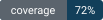
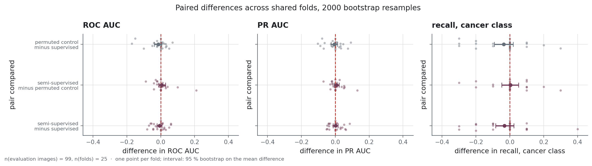
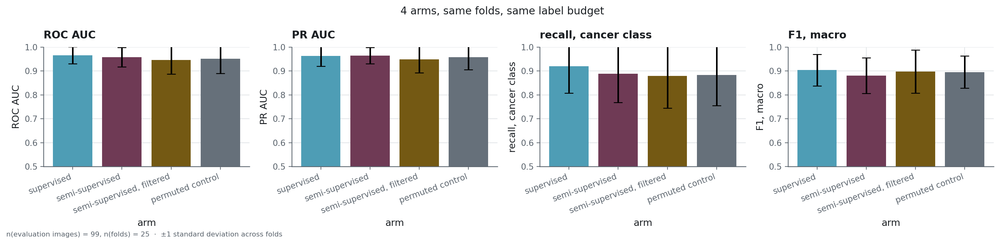
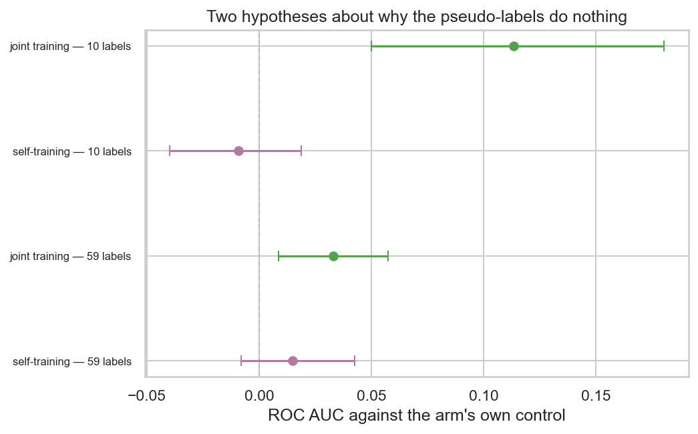
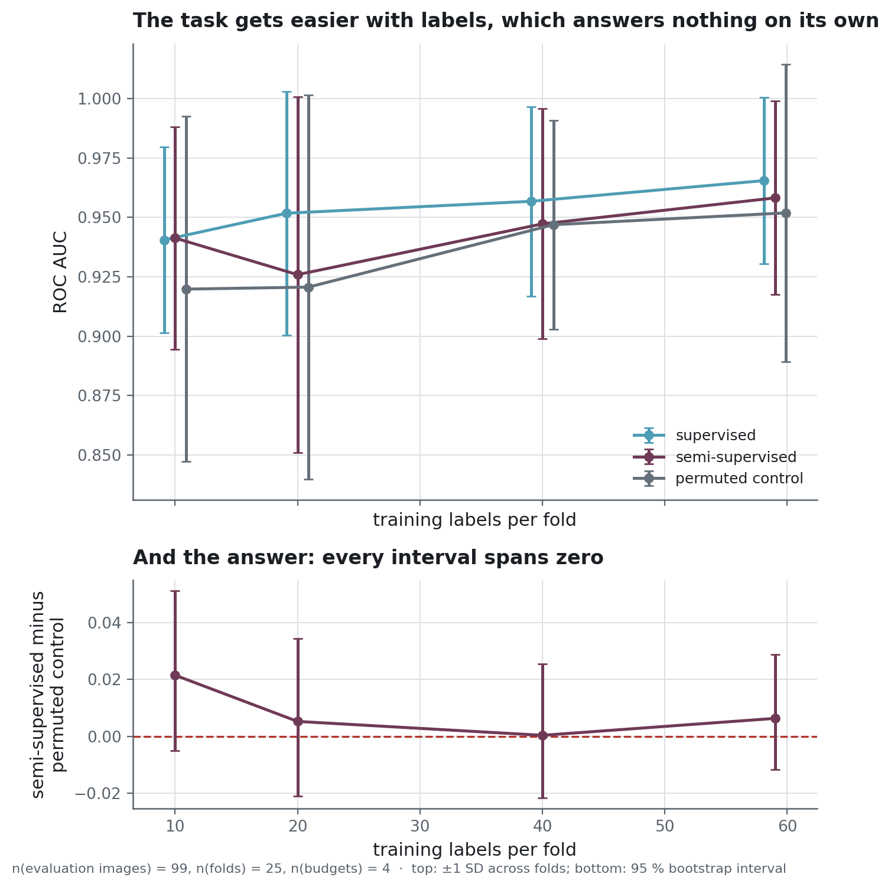
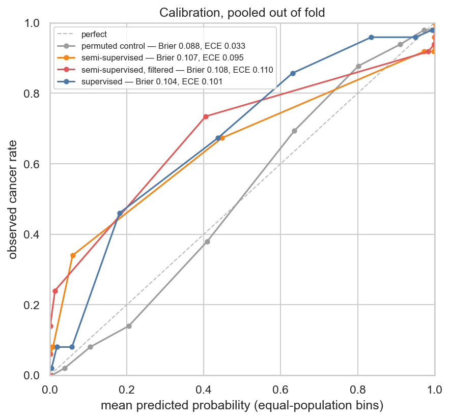
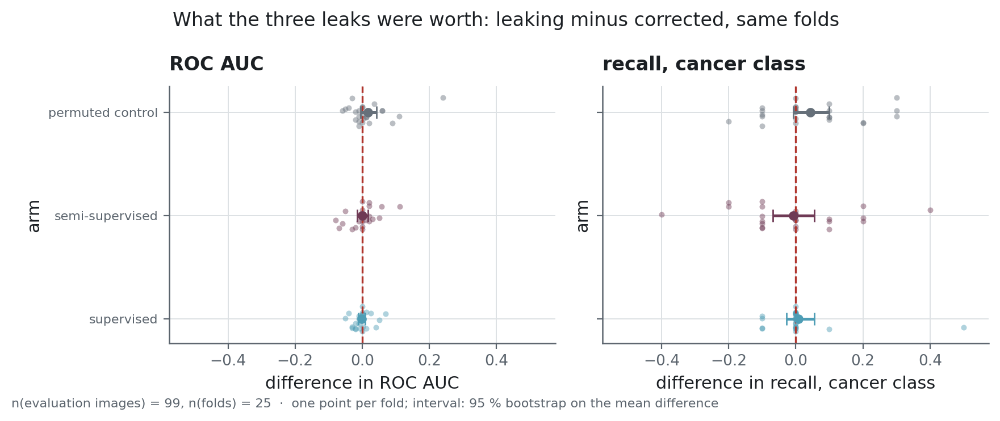

<h1 align="center">Semi-supervised MRI</h1>

<p align="center">A semi-supervised protocol on 100 labelled brain MRIs, built to give a negative answer if that is one</p>

<p align="center">
  
  
  
  
</p>

**Project status** — the experiments are done and the repository is archived at that state.
Eight arms over 25 folds took an evening on one RTX 4060 Ti; every number below names the run
it comes from, and each run folder carries the dataset fingerprint, the seeds, the package
versions and the git revision it was produced with. Reproducing it needs the archive of
images, which is not ours to redistribute.

## The problem

Labelling a brain MRI takes a radiologist. Unlabelled scans are comparatively free, so the
standing question in medical imaging is whether the free ones can be made to pay: cluster the
unlabelled pool, turn the clusters into pseudo-labels, pre-train on those, fine-tune on the
few real labels.

The question is easy to ask and hard to answer honestly, because the experiment that tests it
has three ways of answering yes when it should say no. The pseudo-labels can be built using
the test labels. The evaluation images can appear in the pool. And the semi-supervised arm
can simply take more gradient steps than the arm it is compared to, which measures budget and
calls it method. Each of those turns nothing into a real effect, and none of them looks
unusual in the code.

So the object here is not the model. It is a protocol whose negative answer can be believed,
together with the evidence that it would have said yes had there been anything to say yes to.

## What it does

Eight arms share their folds, their architecture and their starting weights: 25 folds, five
stratified splits repeated five times, over 99 distinct evaluation images with 59 training
labels each. Four of the arms are controls that see the same images with the labels shuffled,
and every treatment is read against its own.

The five design rules that make the comparison mean something, the arms and their pairings,
and the nine tests that assert the protocol cannot leak are in
[`docs/protocol.md`](docs/protocol.md).

### How it is built

Images are embedded once by a frozen **ResNet50** from **torchvision**, cached as **Parquet**
and guarded against a cache built with other preprocessing. Inside each training fold,
**scikit-learn** fits KMeans, Agglomerative-ward, GMM and DBSCAN, and the fold picks between
them on its own data; agglomerative clustering wins 24 folds out of 25. The chosen clustering
becomes pseudo-labels, a **PyTorch** ResNet18 pre-trains on them and is then fine-tuned on
the fold's real labels, with the checkpoint and the threshold decided on an inner validation
split. Intervals are bootstrap over images, comparisons are paired across folds, and Holm
corrects the families.

Around the code: **uv** for a locked environment on two PyTorch indexes, **Ruff** and
**Bandit** on every push, and **pytest** in three tiers whose system tier trains a real
network end to end on a synthetic dataset.

## The result

<!-- source: reports/experiments/arms.csv -->
| arm | what it adds | mean fold ROC AUC | SD across folds | n | run |
|---|---|---|---|---|---|
| `supervised` | nothing: the reference | **0.966** | 0.035 | 99 | `corrected` |
| `self_training` | pseudo-labels from its own first pass | 0.963 | 0.036 | 99 | `corrected-stageb` |
| `semi_supervised` | pseudo-labels from the fold's clustering | 0.958 | 0.041 | 99 | `corrected` |
| `semi_supervised_joint` | the same labels, present at every step | 0.955 | 0.041 | 99 | `corrected-stageb` |
| `permuted_control` | the same images, labels shuffled | 0.952 | 0.063 | 99 | `corrected` |
| `self_training_control` | self-training's images, labels shuffled | 0.948 | 0.069 | 99 | `corrected-stageb` |
| `semi_supervised_confident` | only the pseudo-labels above a confidence cut | 0.945 | 0.058 | 99 | `corrected` |
| `joint_permuted_control` | joint training on shuffled labels | 0.922 | 0.063 | 99 | `corrected-stageb` |
Each row is the mean of 25 fold values at 59 training labels, with their standard deviation
beside it. What each column measures is in [`metrics.yaml`](metrics.yaml).

Every arm that touches the unlabelled pool sits below the baseline that ignores it. No
interval clears zero, and the ordering holds at every budget and under every variant.

<!-- source: reports/figures/MANIFEST.json -->


<!-- source: reports/figures/MANIFEST.json -->


The pooled out-of-fold ROC curves are in
[`docs/protocol.md`](docs/protocol.md#two-quantities-called-roc-auc). They answer a different
question from the table above and read a point or two lower: the table averages the ROC AUC of
each fold, the curve pools every out-of-fold score into one ranking, mixing folds whose scores
are calibrated differently.

### The pseudo-labels do carry information

<!-- source: reports/figures/MANIFEST.json -->


<!-- source: reports/experiments/mechanisms.csv -->
Against its own control, joint training wins clearly: **+0.033 [+0.009, +0.057], p = 0.008**
at 59 training labels, over n = 99 evaluation images.

<!-- source: reports/experiments/mechanisms.csv -->
At 10 labels the same comparison gives **+0.113 [+0.050, +0.180], p = 0.002**, over the same
n = 99 images. The clustering is finding something real, and something a shuffle destroys.
Self-training does not: both its intervals span zero.

Against the baseline the same arms still lose, by 0.010 and 0.016, neither significant. So the
finding is sharper than "semi-supervision does not work here": the pseudo-labels carry real
information, and injecting it costs more than it is worth.

<!-- source: reports/experiments/budget-10-stageb/summary.md -->
**That `p = 0.002` means the opposite of what it looks like.** At 10 training labels, over the
same n = 99 evaluation images, the joint control sits at 0.811, against 0.922 at 59 labels:
training on shuffled labels at every step is catastrophic, far worse than not pre-training at
all. The +0.113 measures how much damage the shuffle does, not how much the real labels add.
Read against its control the arm looks like a win; read against the baseline it is behind.
Which is why both readings are published.

### The curve, and what it rules out

<!-- source: reports/figures/MANIFEST.json -->


<!-- source: reports/experiments/label_efficiency.csv -->
| budget | mean fold ROC AUC | semi minus control | paired p | n |
|---|---|---|---|---|
| 10 labels | 0.941 | +0.022 [−0.005, +0.051] | 0.12 | 99 |
| 20 labels | 0.926 | +0.005 [−0.021, +0.034] | 0.71 | 99 |
| 40 labels | 0.947 | +0.000 [−0.022, +0.025] | 0.97 | 99 |
| 59 labels | 0.958 | +0.006 [−0.012, +0.029] | 0.57 | 99 |
The first column is the semi-supervised arm; its baseline reads 0.941, 0.952, 0.957 and 0.966
at the same four budgets. Intervals are 95 % bootstrap on the paired difference, over 25
folds.

Nothing is significant at any budget, before or after Holm over the family. The largest effect
sits at the smallest budget, which is the direction the literature predicts, and its interval
still spans zero.

### Why it comes out that way

<!-- source: reports/experiments/equalized/summary.md -->
**The clustering was separating images by contrast.** Running the whole protocol again with
histogram equalisation in front of it lifts the supervised baseline to 0.979 ± 0.028 over
n = 99 evaluation images.

<!-- source: reports/experiments/equalized/summary.md -->
Paired over the 25 folds the two runs share, that is **+0.013 [+0.003, +0.024], p = 0.006**
over n = 99 images — the only comparison in this repository that clears conventional
significance. Equalisation also collapses the clustering's agreement with the labels, from an
ARI of 0.457 ± 0.096 to 0.205 ± 0.179. Remove the global intensity differences and the
structure the clustering was finding goes with them: on this dataset contrast happens to
correlate with the class, and it is not what a radiologist would be looking at. Equalisation
stays off by default, and [`docs/architecture.md`](docs/architecture.md) says why.

**And the task is nearly saturated.** The supervised baseline reaches 0.966 with 8 of its 25
folds at exactly 1.000. That leaves 0.034 of headroom against a fold-to-fold standard
deviation of 0.035, and paired intervals about 0.020 wide: a gain would have to close more
than half of what remains to be visible at all. The curve says it from the other side, with a
marginal return of 0.11 AUC points per hundred labels between 10 and 20 and 0.03 between 20
and 40. An ImageNet-pretrained ResNet18 fine-tuned on 59 images has very little left to be
helped with, and that is the most transportable number here: it says how many images someone
would have to annotate before the semi-supervised question even arises.

### What else was measured

<!-- source: reports/figures/MANIFEST.json -->


**The probability scale is off, and by a lot.** Pooled out of fold, the supervised arm has a
Brier score of 0.104 and an expected calibration error of 0.101, for a mean predicted score of
0.407 against a base rate of 0.505. At a predicted 0.18 the observed cancer rate is 0.46; at
0.44 it is 0.67; at 0.63 it is 0.86. Mid-range scores understate risk by twenty points or
more. The scale is published as the network returns it: a calibrator fitted on twenty
images per fold would mostly fit noise, and the size of the gap is the finding.

**The errors sit on the duplicates.** The 31 evaluation images that also live in the pool are
misclassified 0.155 of the time, against 0.068 for the other 68. The gap holds for the
supervised arm, which never sees the pool, so this is not contamination: those images are
simply harder, and being filed twice in the source folders correlates with being difficult.

**A sensitivity-first operating point does not transport.** Fixing a 90 % recall floor on ten
validation positives yields 82.0 % realised recall on the test fold and misses the floor on 51
folds out of 100. It also sits above the F1 threshold on 95 folds out of 100, trading 7 points
of recall for 2 of precision. On this dataset the F1 threshold is the more sensitive of the
two, which is the reverse of what a screening frame wants. Both thresholds and the recall each
one realised are in `reports/experiments/corrected/per_fold.parquet`, fold by fold.

## Why these numbers can be believed

Four guarantees hold the result up, and each one is asserted by a test rather than promised:
identity comes from the pixels and not the path, every decision stays inside its training
fold, every treatment has a control that sees the same images with shuffled labels, and the
checkpoint and threshold are chosen on an inner split that never overlaps the test fold.
[`docs/protocol.md`](docs/protocol.md) lists them with the nine tests that watch them,
including the one that requires the old protocol to leak.

<!-- source: reports/figures/MANIFEST.json -->


Because the same machinery produced a positive answer before. Three leaks and a confound,
reproduced in `reports/experiments/legacy/` on identical folds, so their price is measured
instead of asserted: a third of the evaluation set sat in the training pool, the clustering
method and its alignment were chosen over all 100 labels outside the folds, the comparison
gave the semi-supervised arm more gradient steps than its baseline, and the gain it reported
was a threshold move. The four are told in full in
[`docs/protocol.md`](docs/protocol.md#what-the-earlier-version-got-wrong).

That the errors concentrate on the duplicated images makes the first leak worse than it looks:
what leaked was not a random sample, it was precisely the cases the model gets wrong.

## Running it

```powershell
uv sync --extra dev
$env:MRI_DATA_DIR = "C:\path\to\data"      # where the archive is unpacked; defaults to ./data

uv run python scripts/check_data.py        # is this the same dataset?
uv run python scripts/build_manifest.py    # content identity, duplicates, fingerprint
uv run python scripts/build_features.py    # ResNet50 embeddings, cached
uv run python scripts/run_experiment.py    # the corrected protocol, about an evening
uv run python scripts/build_figures.py     # every figure above
```

The archive unpacks into `<MRI_DATA_DIR>/raw/mri_dataset_brain_cancer_oc/`, with `labelled/`
holding a `cancer/` and a `normal/` folder and `unlabelled/` holding the rest.
`MRI_DATA_DIR` exists because pre-training reads about 1 300 images per epoch, and a
synchronised drive starves the GPU. The other modes, the budgets and the mechanism arms are in
[`docs/protocol.md`](docs/protocol.md#reproducing-a-run).

Tests: `uv run python -m pytest` — 180 tests in three tiers, coverage measured on every run
with a floor.

## Structure

```
src/mri_semisupervised/
├── data/         identity from content, inventory, preprocessing
├── features/     frozen ResNet50 embeddings, cached and guarded
├── models/       clustering helpers, the shared classifier
└── protocol/     everything that touches a label
scripts/          one entry point per stage, from inventory to figures
notebooks/        five questions, generated and executed by the two scripts beside them
reports/          per-fold metrics, out-of-fold predictions, run manifests, figures
tests/            unit, integration and system tiers
```

Why the code is split that way, and what was deliberately left out, is in
[`docs/architecture.md`](docs/architecture.md).

The notebooks are the laboratory, one per question, generated by
`scripts/build_notebooks.py` and executed by `scripts/run_notebooks.py` so that their stored
outputs are the capture of one run: [the dataset and what hashing it
revealed](notebooks/01_dataset.ipynb), [what the embeddings
hold](notebooks/02_embeddings_and_clustering.ipynb), [the protocol and its
arms](notebooks/03_protocol_and_arms.ipynb), [where a gain could have
shown](notebooks/04_label_efficiency_and_mechanisms.ipynb), and [what a returned probability
is worth](notebooks/05_calibration_errors_and_leaks.ipynb).

## What this does not prove

**That semi-supervised learning cannot help here.** Six variants were tried and none beat the
baseline, which is a much stronger statement than one variant would support, and it is still
about clustering-derived and self-derived pseudo-labels over ImageNet embeddings.
Self-supervised pre-training on the pool itself was not tried, and it is the one approach with
a real claim on 1 300 unlabelled images.

<!-- source: reports/dataset_summary.json -->
**Anything at n = 99 evaluation images.** Twenty per fold; one image moves recall by 0.05. Every interval
above is wide because the data is small, and no protocol fixes that. The headroom measurement
above is what makes the limit explicit.

**Generalisation beyond this dataset.** One source, one modality, 512 × 512 slices, and no
patient identifiers, so folds cannot be grouped by patient. That is a property of the archive,
and it is the first question to ask of any real deployment.

## Licence and data

Code under [MIT](LICENSE).

The MRI images are **not** redistributed here and this repository holds no right to
redistribute them: they come as a fixed archive whose terms allow academic use and nothing
more. What is versioned is derived and carries no pixels, which is enough to check every
number above and not enough to reconstruct a single scan.
[`docs/data-source.md`](docs/data-source.md) records where the archive came from, what the
inventory finds in it, and what the rights allow.
