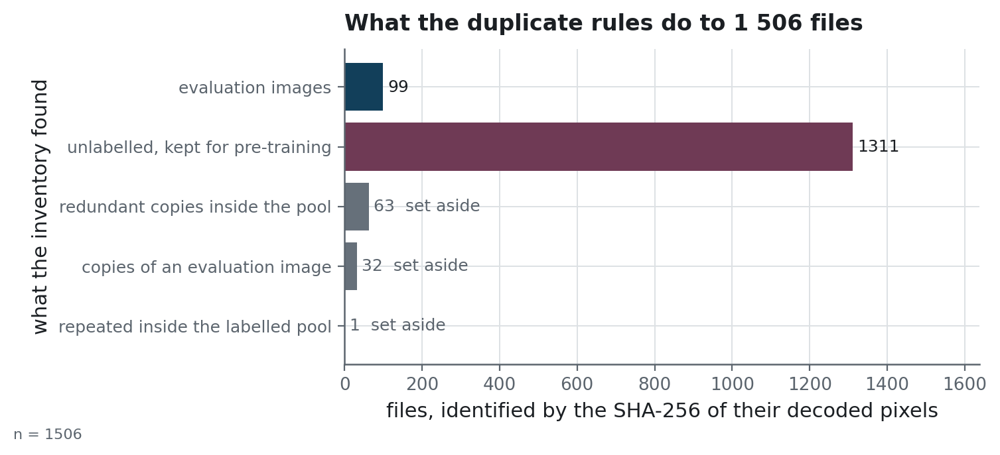
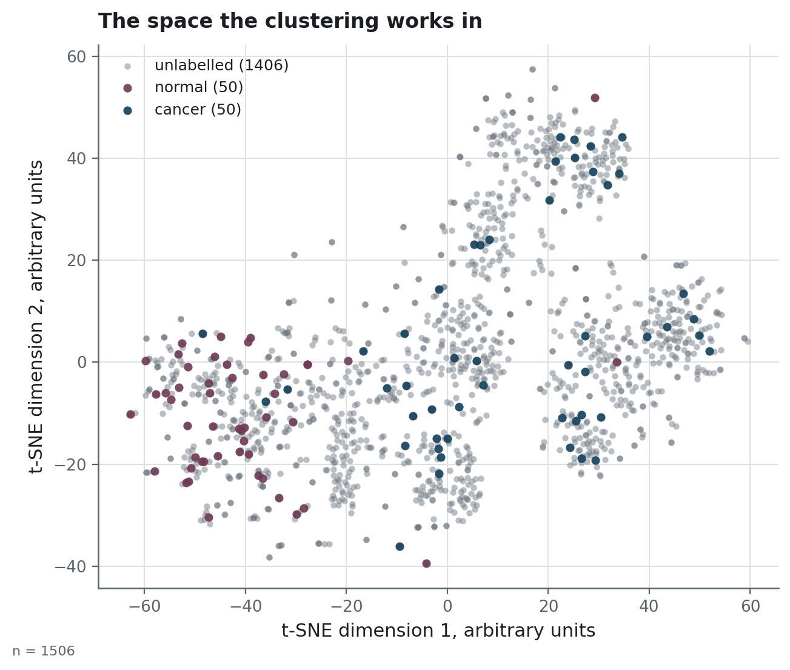

# The images: where they come from, what is in them, what may be done with them

## The archive

A fixed archive of brain MRI slices, `mri_dataset_brain_cancer_oc.zip`, 34.6 MB, received on
2026-05-10 as the material of a study brief. It has no public download page and no upstream
URL: the file is handed over with the brief, and this page is the only provenance record
there is.

The note shipped inside it announces 1 500 images, 1 400 of them unlabelled. The folders hold
1 506 files, 1 406 of them unlabelled. Nothing in the archive explains the six extra, and
they are counted here as they are found.

## What is in it

| | |
|---|---|
| Files | 1 506 (100 labelled, 1 406 unlabelled) |
| Format | JPEG, 512 × 512, RGB, one slice per file |
| Labelled classes | `cancer` and `normal`, as two folders |
| Patient identifiers | none: no series, no study, no date |
| Dataset fingerprint | `8f22a69ffa46ca1f` |

The fingerprint is the SHA-256 of the sorted content identities, truncated to sixteen
characters. Every run manifest under `reports/experiments/` carries it, which is what lets
someone holding the same archive confirm they are looking at the same images.

## What the inventory finds

`scripts/build_manifest.py` identifies every file by the SHA-256 of its **decoded pixels**,
so a re-encoded copy of a scan lands on the identity of the original. The counts below are
what that identity turns up, and they are the reason the protocol looks the way it does:

<!-- source: ../reports/dataset_summary.json -->
| | |
|---|---|
| Distinct labelled images | 99 (one file is a second copy of another) |
| Class balance of those 99 | 50 cancer, 49 normal |
| Labelled images also sitting in the unlabelled pool | 31, in 32 files |
| Redundant copies inside the unlabelled pool | 63 |
| Unlabelled images left for pre-training | 1 311 |
n = 1 506 files. `scripts/build_manifest.py` writes these counts to
[`reports/dataset_summary.json`](../reports/dataset_summary.json), which is where they are read from.

<!-- source: ../reports/figures/MANIFEST.json -->

A labelled image found in the pool leaves the **pool** and stays in the evaluation set:
removing it from the evaluation would be choosing the test set after having looked at it.
[`protocol.md`](protocol.md) carries the three rules in full, and what they cost.

<!-- source: ../reports/figures/MANIFEST.json -->

The embeddings are what the clustering works in, and the projection above is what a reader
can check without holding a single scan: the two classes sit in different regions, the pool
covers both, and no image is redistributed to show it.

## The other input: the pretrained weights

The pipeline has a second source, and it determines every embedding it computes: the ImageNet
weights of the two networks, downloaded by torchvision from
`https://download.pytorch.org/models/`. `ResNet50_Weights.IMAGENET1K_V2` produces the features
the clustering reads; `ResNet18_Weights.IMAGENET1K_V1` is the starting point every arm
fine-tunes from. Both are published by the PyTorch project under its BSD-3-Clause licence
(<https://github.com/pytorch/vision/blob/main/LICENSE>), and the version of `torchvision` that
fetched them is recorded in every run manifest.

They are not redistributed here either. They download on first use, into the torch cache.

## Rights

The note inside the archive states its terms in one line: free use for academic purposes. It
grants no right of redistribution, and none is claimed here.

**No image is committed to this repository.** What is versioned is derived and carries no
pixels: fold indices, per-fold metrics, out-of-fold scores, and the run manifests. Anyone
reproducing the work supplies their own copy of the archive and points `MRI_DATA_DIR` at it;
`scripts/check_data.py` says whether what they pointed at is the same dataset.

That rule cost one figure. A plate of the twelve most-missed scans was once committed with
the plots; it is generated on demand now, ignored by git, and purged from the history.

## Personal data

The slices carry no identifier of any kind — no patient, no study, no acquisition date, and
no DICOM header. That also means the first thing a medical dataset needs, grouping folds by
patient, cannot be checked here: two slices of the same person would be treated as two
independent images and nothing in the archive would say otherwise. It is a limitation of the
data, and the first question to ask of any real deployment.
