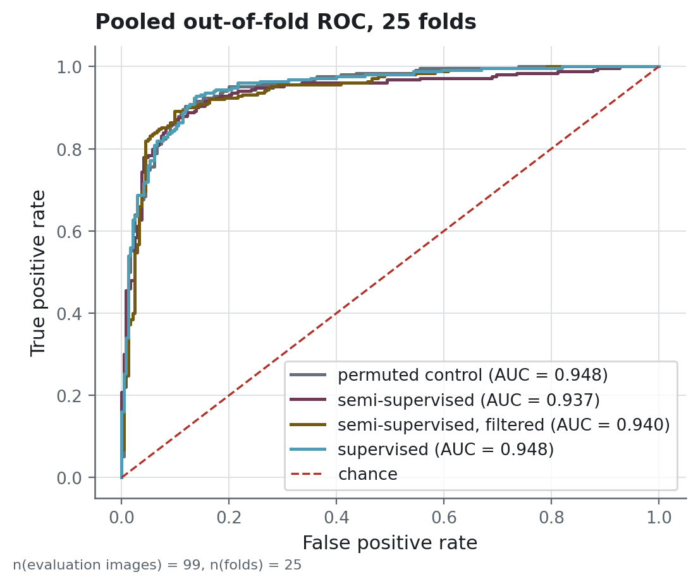

# The protocol: what it guarantees, and how it was checked

The object of this repository is a comparison that can come out negative and be believed.
This page is what makes that claim checkable: the rules the design rests on, the eight arms
and the control each one is read against, and the tests that assert the guarantees hold.

## Five rules

**Identity comes from content.** Every image is keyed by the SHA-256 of its decoded pixels,
never by its path. Two copies of one scan in two folders are one image. The duplicate rules
are written down because each is a decision: a copy found in the pool leaves the pool and
stays in the evaluation set; a repeated evaluation image is reduced to one; the same content
under two labels stops the build instead of being quietly resolved.

**The fold is a boundary.** Clustering, the choice of clustering method, and the mapping from
cluster to class all happen inside the training fold. The test fold takes part in no
decision — not the checkpoint, not the threshold, not the method.

**Every treatment has its own control.** Each pre-training arm has a twin that sees exactly
the same images with the labels shuffled. That twin is what separates information from
exposure, and it is the reason a null result here says anything at all.

**Model selection is honest.** An inner validation split, carved out of the training fold,
decides the checkpoint, the stopping point and the decision threshold. It holds 20 images at
every label budget, so selection is comparable along the whole curve.

**Uncertainty comes first.** Comparisons are paired across shared folds, intervals are
bootstrap over images, and Holm correction is applied over the families of comparisons this
project actually ran.

## The eight arms

| arm | what it adds | its control |
|---|---|---|
| `supervised` | nothing: the reference | none |
| `semi_supervised` | pseudo-labels from the fold's clustering | `permuted_control` |
| `semi_supervised_confident` | only the pseudo-labels above a confidence cut | `permuted_control` |
| `semi_supervised_joint` | the same labels, present at every step | `joint_permuted_control` |
| `self_training` | pseudo-labels from its own first pass | `self_training_control` |
| `permuted_control` | the same images, labels shuffled | it is one |
| `joint_permuted_control` | joint training on shuffled labels | it is one |
| `self_training_control` | self-training's images, labels shuffled | it is one |

The joint arm needs its own control rather than the plain baseline, and the reason is a
second treatment nobody intended: its pseudo batches pass through the network in train mode,
so BatchNorm absorbs the pool's statistics even when the pseudo-label loss is weighted at
zero. Read against the supervised baseline, that arm would measure two things at once.

## Two quantities called ROC AUC

The table in the README averages the ROC AUC of each fold. The figure below pools every
out-of-fold score into a single ranking and computes one curve from it. Both are honest, and
they differ: pooling mixes folds whose scores sit on slightly different scales, which costs a
point or two. The run summary publishes both, and every comparison between arms is made
within one of them, never across.

<!-- source: reports/figures/MANIFEST.json -->


## What the earlier version got wrong

The same machinery produced a positive answer before. `reports/experiments/legacy/`
reproduces that version: three leaks and nothing else, on identical folds, so the difference
between the two runs prices them instead of asserting them.

**A third of the evaluation set was in the training pool.** The image identity hashed the
path, so one scan filed twice became two images, and the guard meant to keep labelled images
out of the pool never fired. 31 of the 99 distinct evaluation images were in the pool the
semi-supervised arm pre-trained on.

**The clustering method was chosen using the test labels**, and so was the cluster-to-class
alignment. Both were decided once, over all 100 labels, outside any fold: every test fold
helped pick the method that would later be tested on it.

**The comparison confounded method with budget.** The semi-supervised arm simply took more
gradient steps than the baseline it was compared to.

**And the gain it reported was a threshold move.** Recall on the positive class rose from
0.900 to 0.960 while ROC AUC *fell* from 0.982 to 0.954. A model that ranks better cannot do
that; what had moved was the implicit cut at 0.5.

One detail is worth the trouble on its own: the agreement between pseudo-labels and true
labels reads 0.481 ± 0.000 under the leak and 0.457 ± 0.096 once computed per fold. The leak
did not only inflate the number — it made it look far steadier than it is.

## The tests that assert the absence of leakage

```powershell
uv run python -m pytest tests/integration
```

Eight of them watch the orchestration: no test image in any pre-training set, no labelled
image either, the copies of evaluation images never reaching it, the inner validation never
drawn from the test fold, every arm of a fold sharing one split, and each control
pre-training on exactly the same images as the arm it controls.

A ninth asserts the opposite. The `legacy` mode **must** pre-train on the copies of its own
test images: without that test, the other eight could pass over a protocol that never had a
defect, and would prove nothing.

The same pairing guards the alignment. One test flips the labels the mask hides and checks
that nothing moves; another shows those same labels *would* have changed the answer had they
been read.

Two more are worth naming because they caught real defects. One asserts that no implemented
arm can be registered and then never run — a fourth arm was once added to the registry and
not to the configuration, and the experiment ran three arms while every test passed. The
other records the BatchNorm effect above, so that the day someone reads the joint arm against
the plain baseline, a test says why not.

## Reproducing a run

```powershell
uv run python scripts/build_manifest.py    # content identity, duplicate rules, fingerprint
uv run python scripts/build_features.py    # frozen ResNet50 embeddings, cached
uv run python scripts/run_experiment.py    # the corrected protocol, 25 folds
uv run python scripts/run_experiment.py --mode legacy     # price the three leaks
uv run python scripts/run_experiment.py --mode equalized  # the preprocessing variant
uv run python scripts/build_figures.py     # every published figure
```

One point of the label-efficiency curve, and the two mechanism arms:

```powershell
uv run python scripts/run_experiment.py --label-budget 10 `
  --arms supervised,semi_supervised,permuted_control
uv run python scripts/run_experiment.py --arms semi_supervised_joint,joint_permuted_control `
  --out-name corrected-stageb
```

Each run writes its own folder under `reports/experiments/`: the per-fold metrics, the raw
out-of-fold predictions, a manifest naming the dataset fingerprint, the seeds, the package
versions, the GPU and the git revision, and a summary page rebuilt from those three files by
`scripts/rebuild_summaries.py`.
